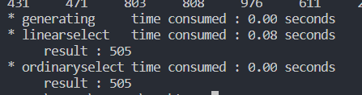
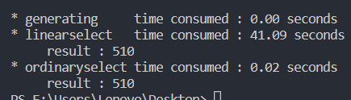

# 线性选择算法 实验报告 #

> 毛圆鑫  201721012271  
> 完成日期：19.10.14   
> 注意：由于代码比较长，所以本文中的代码均以片段的形式给出，完整代码请见附的两个.cpp文件，或[https://github.com/punk-boy/algorithm/](https://github.com/punk-boy/algorithm/)下的 **linearselect1.cpp** 和 **linearselect2.cpp**    

[TOC]

## 伪代码 ##  
```c++
LiearSelect(s, low, high, k)
1. n <- high - low + 1
2. if n < 75 then 将s中元素排序 return s[k]
3. q <- ceil(n/5)
4. 将s划分为无公共元素的q组，每组5个元素
5. 将所有分组的单元单独排序，令各组中位数组成集合M
6. x <- LinearSelect(M, 1, q, ceil(q/2))
7. 利用x将s划分为三个子集，A <- {s|s属于s且s<x}, B <- {s|s属于s且s=x}, C <- {s|s属于s且s>x}
8. if |A| > k then return LinearSelect(A, |A|, k)
9. else if |A|+|B| < k then return LinearSelect(C, |C|, k-|A|-|B|)
10. else return x
```

## 第一次实验的代码 ##   

为了说明方便：这里给出一些定义：
***odinaryselect*** : 就是普通的选择，先排序，再根据排序的结果查找  
***linearselect***  : 线性时间选择，是本次算法实验的主角  

+ 生成随机数测试案例  
    ```c++
    #include <time.h>
    #include <stdlib.h>

    const int LEN = 102400;
    const int range = 1024;
    vector<int> array(LEN, 0);
    int k = LEN / 2;

    // generate the array data
    start = clock();
    srand((unsigned)time(NULL));
    for (int i=0;i<LEN;i++)
        array[i] = rand() % range + 1;
    end = clock();
    gen = end - start; // log the time consumed to generate the array data 
    ```

+ 监控算法的运行时间  
    ```c++
    // linear select
    start = clock();
    lresult = result = linearselect(array, 0, LEN - 1, k);
    end = clock();
    ls = end - start;

    // ordinary slect (powered by quick sort)
    start = clock();
    oresult = result = ordinaryselect(array, 0, LEN - 1, k);
    end = clock();
    os = end - start;

    // output the time consume
    printf("\n");
    printf("* generating     time consumed : %.2lf seconds\n", gen / CLOCKS_PER_SEC);
    printf("* linearselect   time consumed : %.2lf seconds\n", ls  / CLOCKS_PER_SEC);
    printf("     result : %d\n", lresult);
    printf("* ordinaryselect time consumed : %.2lf seconds\n", os / CLOCKS_PER_SEC);
    printf("     result : %d\n", oresult);
    ```

+ odinaryselect  
    ```c++
    int ordinaryselect(int * s, int low, int high, int k)
    {
        int n = high - low + 1;
        sort(s, s+n);
        return s[k];
    }
    ```

+ linearselect
    ```c++
    int linearselect(vector<int> & s, int low, int high, int k)
    {
        int n = high - low + 1;
        if (n < 75)
        {
            sort(s.begin(), s.end());
            return s[k];
        }
        
        int q = (int)ceil(1.0 * n / 5);
        
        vector<vector<int> > inner(q, vector<int>(5, 0));
        
        for(int i=low;i<=high;i++)
            inner[i/5][i%5] = s[i];
            
        for(int i=0;i<inner.size();i++)
            sort(inner.begin(), inner.end());
        
        // generate the M & x
        vector<int> M;
        for(int i=0;i<inner.size();i++)
        {
            int center = (int)ceil(1.0 * inner[i].size() / 2);
            M.push_back(inner[i][center]);
        }
            
        int x = linearselect(M, 0, M.size()-1, (int)ceil(1.0 * q / 2));
        
        //generate the A, B, C
        vector<int> A, B, C;
        for(int i=0;i<s.size();i++)
        {
            if(s[i] < x)
                A.push_back(s[i]);
            else if(s[i] == x)
                B.push_back(s[i]);
            else
                C.push_back(s[i]);
        }
        
        
        if(A.size() > k)
            return linearselect(A, 0, A.size()-1, k);
        else if(A.size() + B.size() < k)
            return linearselect(C, 0, C.size()-1, k-A.size()-B.size());
        else
            return x;
    }
    ```


## 第一次实验的结果和总结 ##   
  
*这是n=1024的结果*  
得到的结果时 时间复杂度度为 O(nlogn) 的 odinaryselect 在真实的测试的时候 消耗的时间远远的好于时间复杂度 **“貌似”** 为 O(n) 的 linearselect，甚至当 n 取到 100,000 数量级的时候，linearselect算法已经无法在我能忍受的时间内求解到结果了。

仔细想想，结果是这样也不奇怪，因为 STL vector 的维护是需要动态的进行的，再它扩容的时候就会消耗掉大量的时间和空间，所以我就为了能看到效果，老老实实的又写了一个纯用数组做的 linearselect。


## 第二次实验的代码 ##   
 
其他的部分都没有改动，主要是对 linearselcet 算法的改动，从原来的用 vector 改为用 基础的数组。
+ 新的linearselect
    ```c++
    int linearselect(int * s, int low, int high, int k)
    {
        
        int n = high - low + 1;

        if (n < 75)
        {
            sort(s, s+n);
            return s[k];
        }
        
        int q = (int)ceil(1.0 * n / 5);
        int ** inner;
        inner = (int **)malloc(sizeof(int *) * q);
        for(int i=0;i<q;i++) inner[i] = (int *)malloc(sizeof(int) * 6);

        
        for(int i=0;i<q;i++)
            inner[i][5] = 0;
        
        for(int i=0;i<n;i++)
        {
            inner[i/5][i%5] = s[i];
            inner[i/5][5] ++; 
        }
            
        for(int i=0;i<q;i++)
            sort(inner[i], inner[i]+5);
        
        // generate the M & x
        int * M = (int *)malloc(sizeof(int) * q);
        for(int i=0;i<q;i++)
        {
            int center = (int)ceil(1.0 * inner[i][5] / 2);
            M[i] = inner[i][center];
        }
            
        int x = linearselect(M, 0, q-1, (int)ceil(1.0 * q / 2));
        //generate the A, B, C
        int MAX_LEN = (int)ceil(1.0 * 3 * n / 4);
        int * A = (int *)malloc(sizeof(int) * MAX_LEN), la = 0;
        int * B = (int *)malloc(sizeof(int) * MAX_LEN), lb = 0;
        int * C = (int *)malloc(sizeof(int) * MAX_LEN), lc = 0;
        for(int i=0;i<n;i++)
        {
            if(s[i] < x)
                A[la++] = s[i];
            else if(s[i] == x)
            {
                B[lb++] = s[i];
            }	
            else
            {
                C[lc++] = s[i];
            }
        }
        
        if(la > k)
            return linearselect(A, 0, la-1, k);
        else if(la + lb < k)
            return linearselect(C, 0, lc-1, k-la-lb);
        else
            return x;
    }
    ```


## 第二次实验的结果和总结 ##   
  
*这是n=102400的结果*  
**STL** 中的 **sort** 算法应该是有过优化的，我已经是绞尽脑汁地想了优化地方法了，但是 得到的结果依然是 ordinaryselect 的时间 优于 linearselect。不过综上所述，我以后敲代码是不会选择 linearselect，因为实验效果并不好，而且还挺难敲的。  


 